#QiniuLab 七牛云存储实验室

##简介

最新版本下载[QiniuLab-v1.3](http://devtools.qiniu.com/QiniuLab-v1.3.zip)

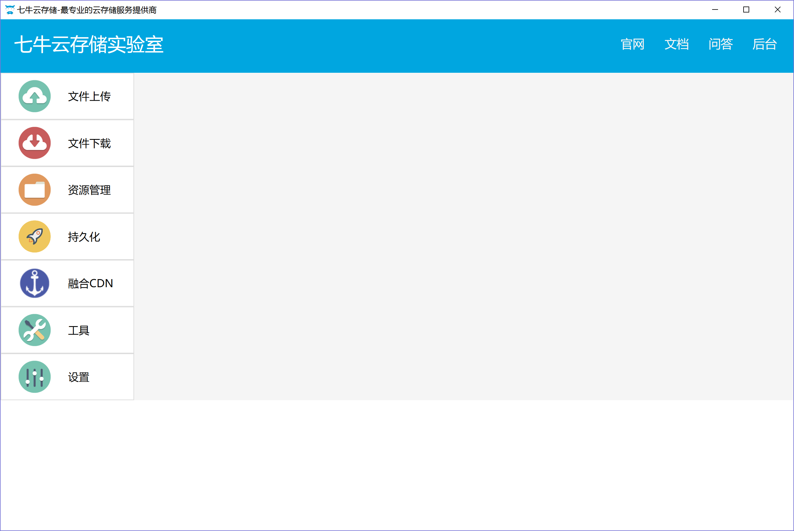

(1)功能菜单(左侧工具栏)

文件上传、文件下载、资源管理、持久化、融合CDN、工具、设置

(2)快捷链接(右上角文本链接)

七牛云存储官网、开发者文档、七牛云相关问答(Segment Fault)、用户管理后台(portal)

(3)快捷导航

历史菜单操作会被记录，点击导航按钮或者下拉按钮可以快速定位

##设置

账号设置，设置AK&SK

其中AK&SK可以在portal的“密钥管理”页面找到

######更新内容 -- SK支持显示/隐藏

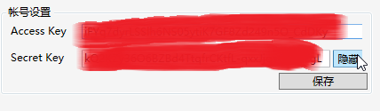
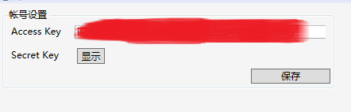

##文件上传

点击左边栏“文件上传”-->配置“上传策略”-->“生成Token”-->“浏览并上传文件”

处理结果(回复消息查看)

除了普通方式之外还可以按照其他方式查看：

##文件下载

私有空间文件受到保护(未被授权)无法直接下载，如下图：

为了得到授权的访问(可下载)，可以依照以下流程操作生成授权的下载外链：

用已授权的外链访问（请在有效期内执行），可以正常下载，如下图：

##资源管理

已集成几乎全部功能，如stat, copy, move, delete, batch等

######更新内容 -- copy/move 支持force参数

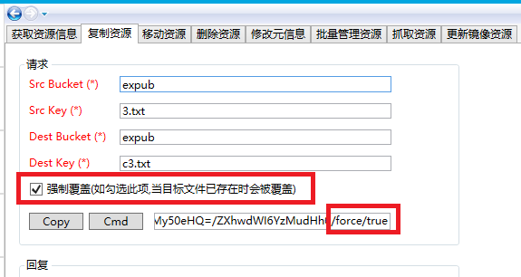

某些情形下回复“内容”为空

可以切换查看RAW“信息”，如下图：

##批处理

格式为：`op=(opString1)&op=(opString2)&op=…`

######已更新

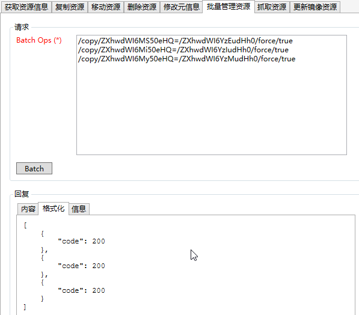

##持久化

持久化(pfop)可以参考[官方文档介绍](http://developer.qiniu.com/article/index.html#fop-official)

持久化结果查询

######已更新

######触发持久化示例：给视频添加水印

以下给出一个简单的示例，假设空间里有一个test.mp4视频，现在想要通过qiniulab工具对该视频添加一个水印(水印图片可以是网络上的或者空间里的，能被访问到)并保存。示例代码如下：
	avthumb/mp4/wmImage/aHR0cDovL3h4eC5ia3QucWluaXVkbi5jb20vd2F0ZXJtYXJrLnBuZw==|saveas/dmlkZW90ZXN0Om91dHB1dC5tcDQ=

其中：

`wmImage`后面接的参数`aHR0cDovL3h4eC5ia3QucWluaXVkbi5jb20vd2F0ZXJtYXJrLnBuZw==`是url_safe_base64编码的水印图片地址`http://xxx.bkt.qiniudn.com/watermark.png`

`saveas`后面接的参数`dmlkZW90ZXN0Om91dHB1dC5tcDQ=`是url_safe_base64编码的保存文件名，表示将要保存为`videotest:output.mp4`

如果直接进行操作可能会因为任务排队造成长久等待，为了加快处理速度， 建议使用私有队列。以下
根据此需求（ 给视频添加水印）列出具体步骤，供您参考。

1.新建多媒体处理私有队列：

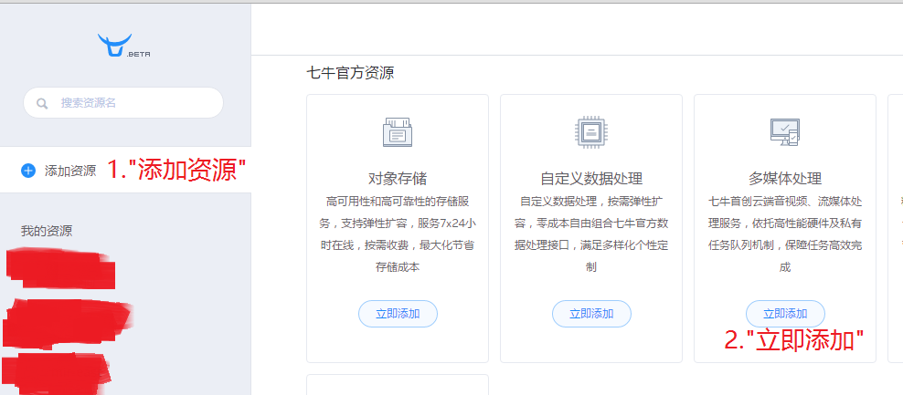

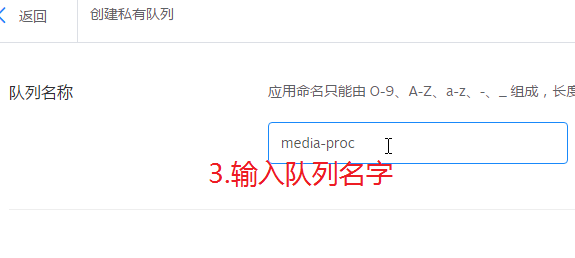

2.打开工具，选择【持久化】创建任务：

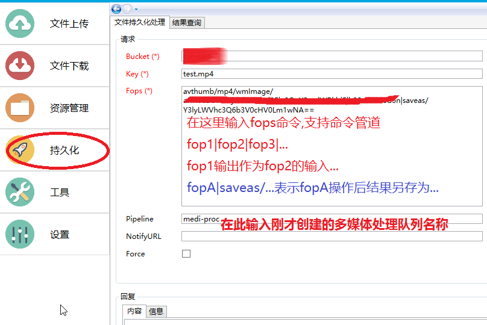

在fops输入框中输入fop命令，支持管道方式。

3.设置好参数后执行【Pfop】，稍后可以查询处理结果：

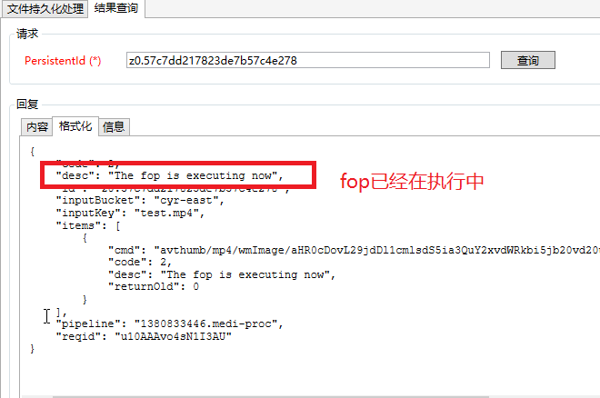

4.回到开发者平台-多媒体处理页面，可以查看所有作业：

更多内容，请参考[音视频转码界面化操作队列](https://qiniu.kf5.com/hc/kb/article/147363/)，[音视频转码接口](http://developer.qiniu.com/code/v6/api/dora-api/av/#avthumb)，持久化处理-[对已有资源手动触发](http://developer.qiniu.com/article/developer/persistent-fop.html#pfop-existing-resource)

##融合CDN加速

帮助文档请戳[这里](http://developer.qiniu.com/article/index.html#fusion-api-handbook)

* 缓存刷新

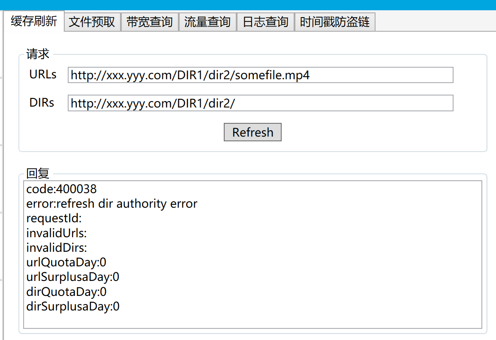

* 文件预取

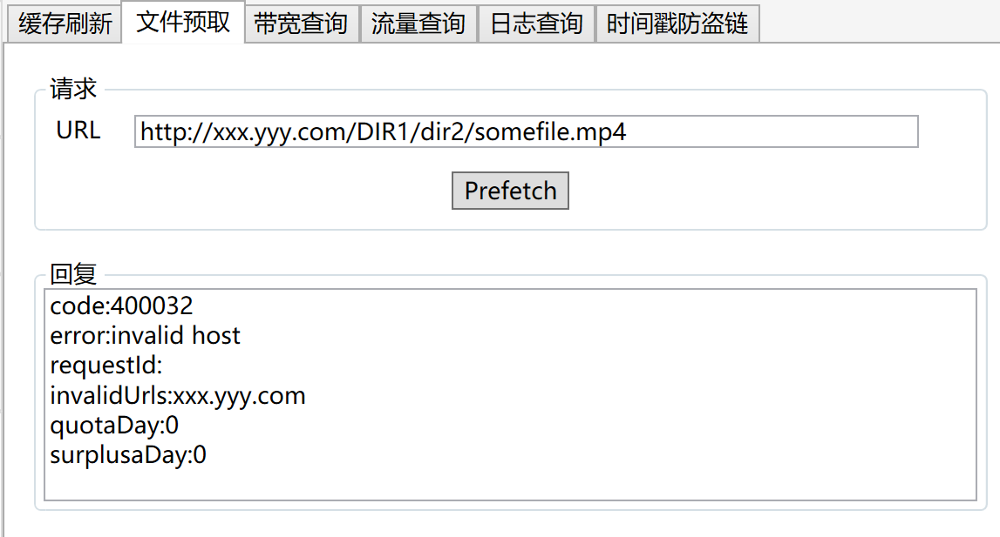

* 带宽查询

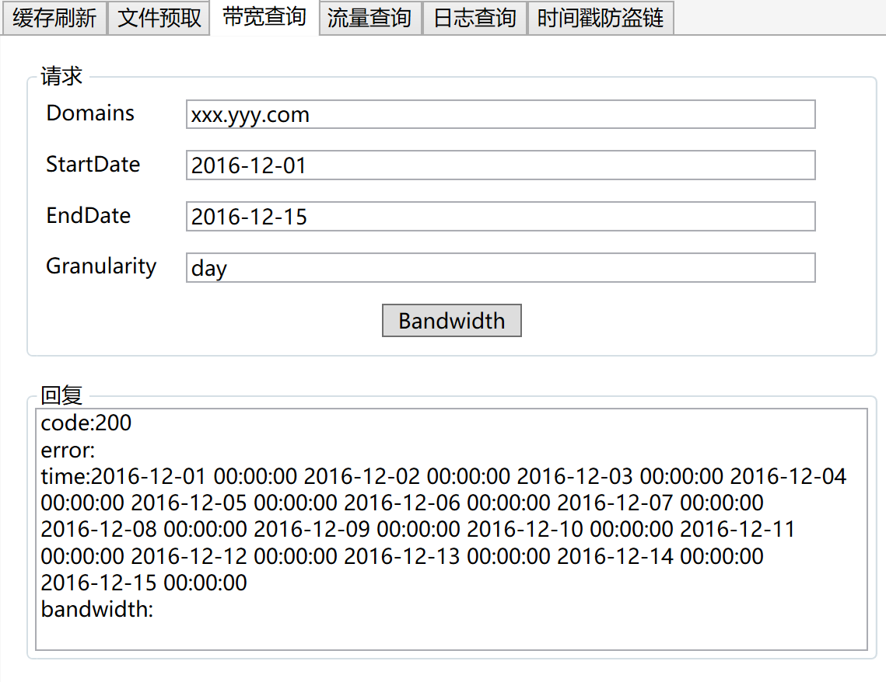

* 流量查询

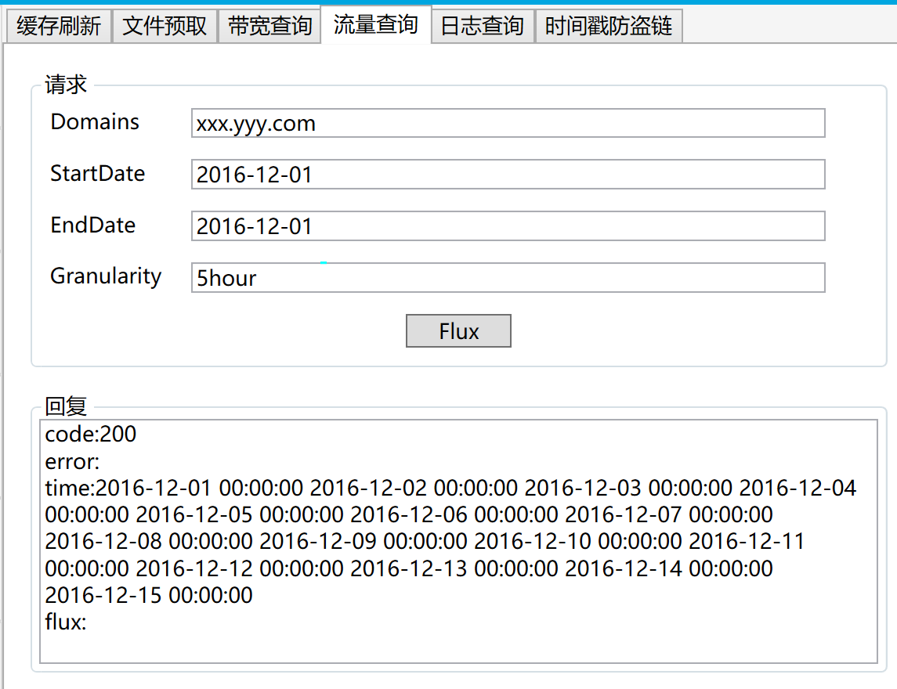

* 日志查询

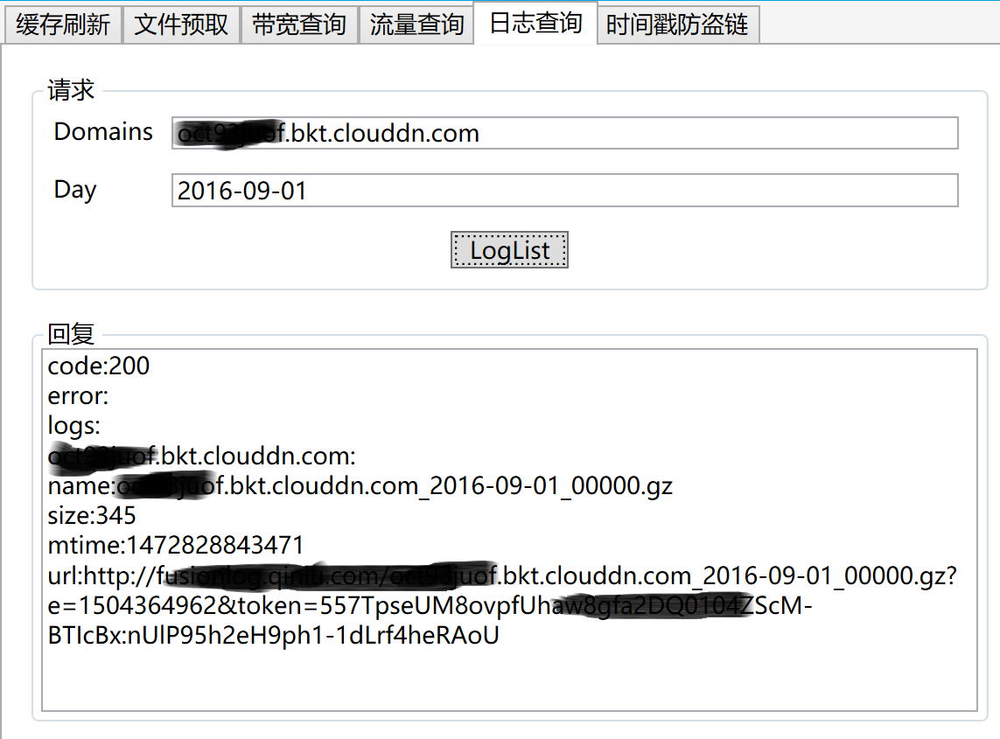

* 时间戳防盗链

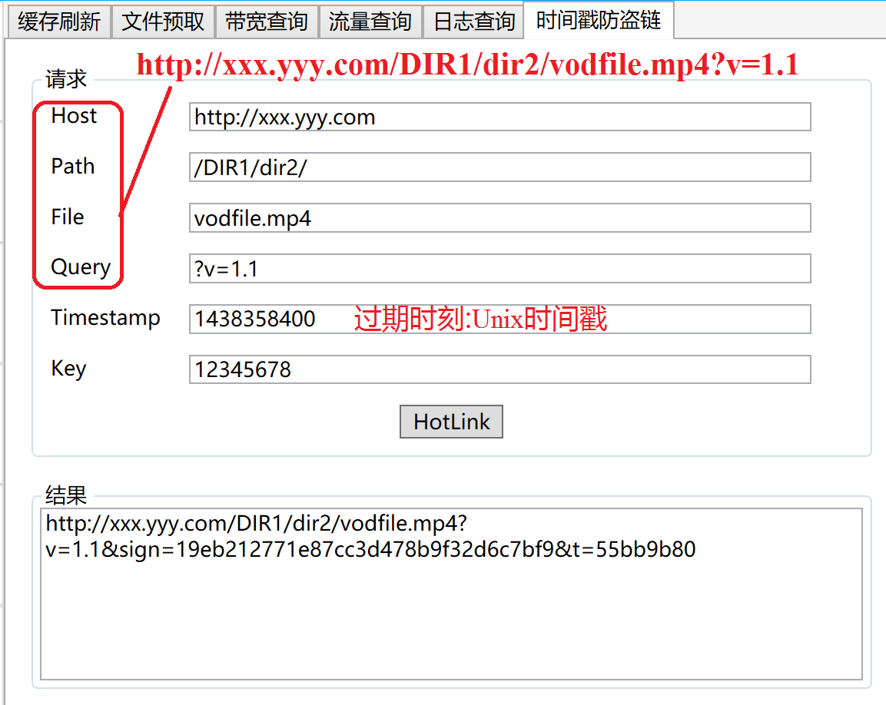

##工具

Base64编码/解码

QEtag计算和CRC32校验码

##意见&帮助

如果你有任何的意见，可以通过提 issue，我们来讨论。
