#QiniuLab 七牛云存储实验室

##简介

最新版本下载[QiniuLab-v1.2](http://devtools.qiniu.com/QiniuLab-v1.2.2.zip)

(1)功能菜单(左侧工具栏)

文件上传、文件下载、资源管理、持久化、工具、设置

(2)快捷链接(右上角文本链接)

七牛云存储官网、开发者文档、七牛云相关问答(Segment Fault)、用户管理后台(portal)

(3)快捷导航

历史菜单操作会被记录，点击导航按钮或者下拉按钮可以快速定位

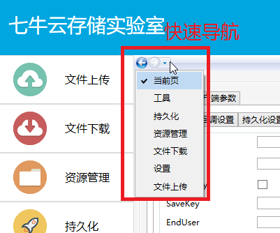

##设置

账号设置，设置AK&SK

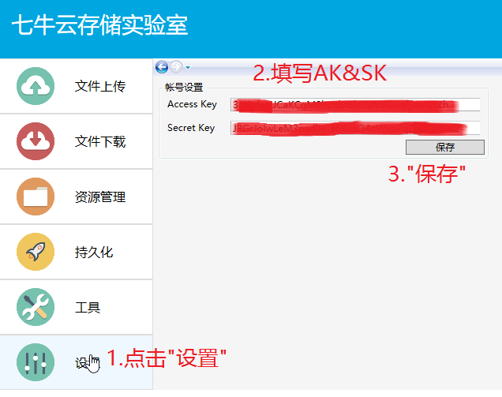

其中AK&SK可以在portal的“密钥管理”页面找到

##文件上传

点击左边栏“文件上传”-->配置“上传策略”-->“生成Token”-->“浏览并上传文件”

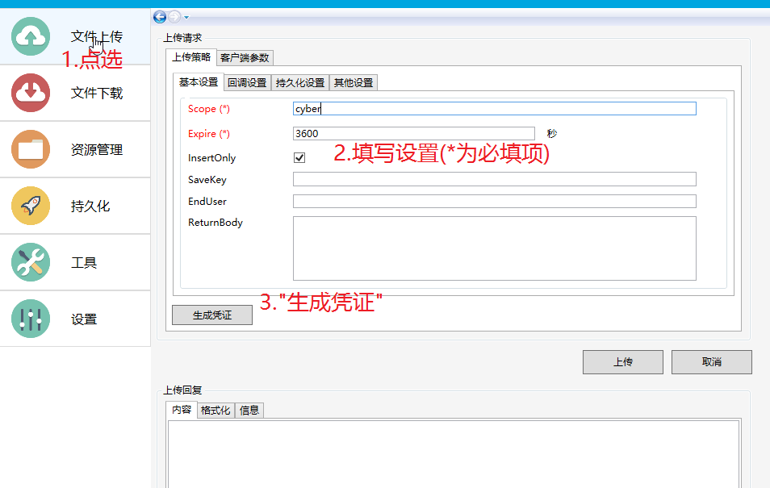

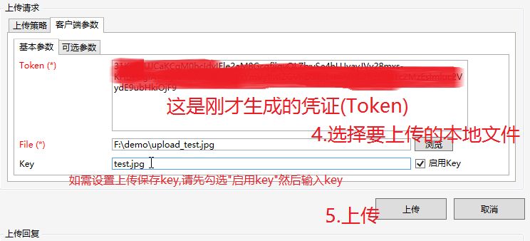

处理结果(回复消息查看)

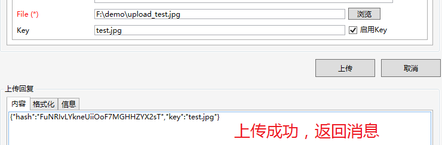

除了普通方式之外还可以按照其他方式查看：

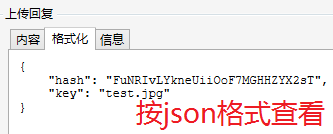

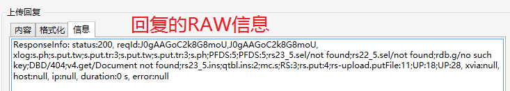

##文件下载

私有空间文件受到保护(未被授权)无法直接下载，如下图：

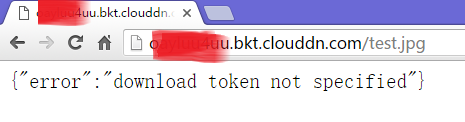

为了得到授权的访问(可下载)，可以依照以下流程操作生成授权的下载外链：

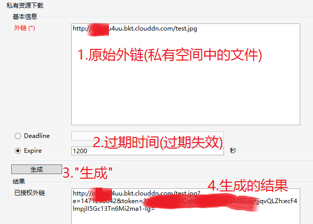

用已授权的外链访问（请在有效期内执行），可以正常下载，如下图：

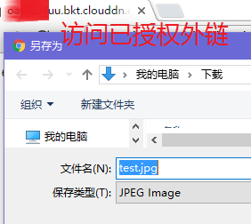

##资源管理

已集成几乎全部功能，如stat, copy, move, delete, batch等

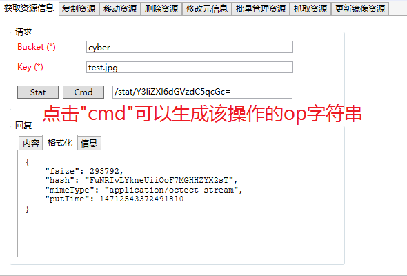

某些情形下回复“内容”为空

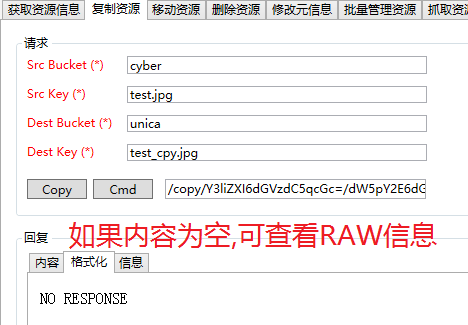

可以切换查看RAW“信息”，如下图：

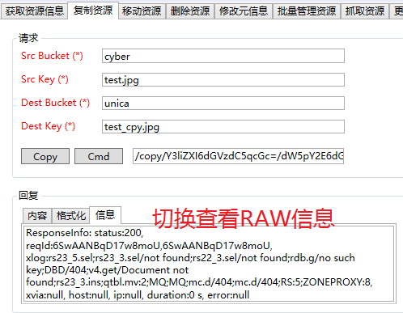

##批处理

格式为：`op=(opString1)&op=(opString2)&op=…`

##持久化

持久化(pfop)可以参考[官方文档介绍](http://developer.qiniu.com/article/index.html#fop-official)

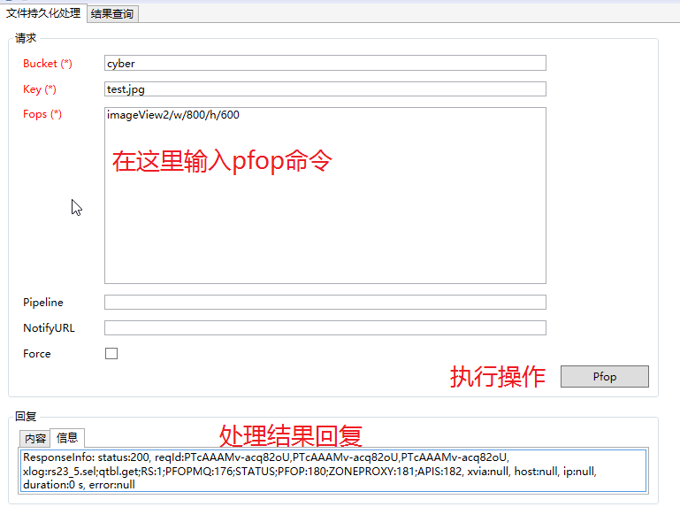

持久化结果查询

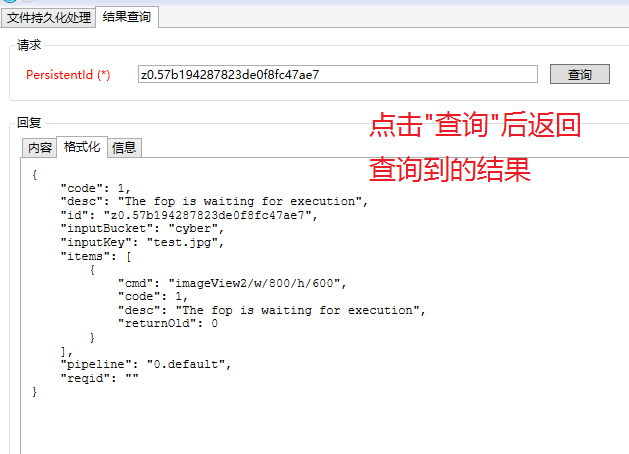

##工具

Base64编码/解码

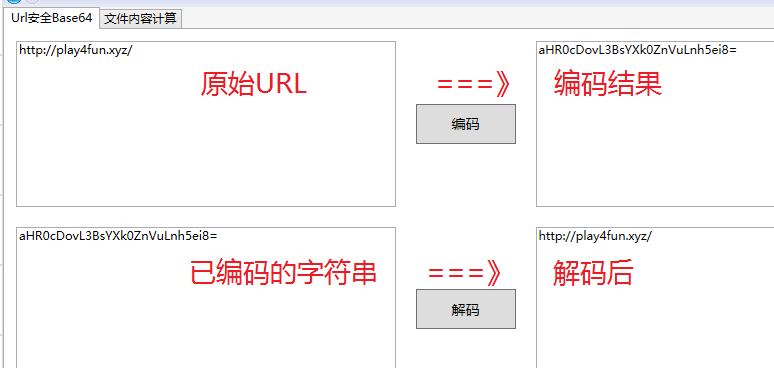

QEtag计算和CRC32校验码

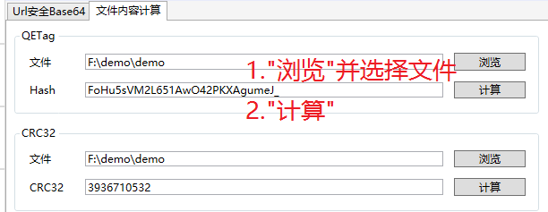

##意见&帮助

如果你有任何的意见，可以通过提 issue，我们来讨论。
